# Laboratorio 01: Configuración del Entorno de Pruebas y Repositorio

## Objetivo del ejercicio

Configurar un entorno base de pruebas automatizadas utilizando Git, GitHub y pytest.

## Herramientas utilizadas

* Sistema de Control de Versiones: Git & GitHub
* Lenguaje de Programación: Python
* Framework de Pruebas: pytest
* Editor de Código: Visual Studio Code

## Estructura del proyecto

src/: código fuente
tests/: pruebas automatizadas

## Ejecución de Pruebas

Para ejecutar las pruebas automatizadas de los ejercicios, se navega a la raíz del proyecto y se ejecutan los comandos correspondientes en la terminal.

### Ejercicio 1 — Test de saludo

Archivo saludo.py
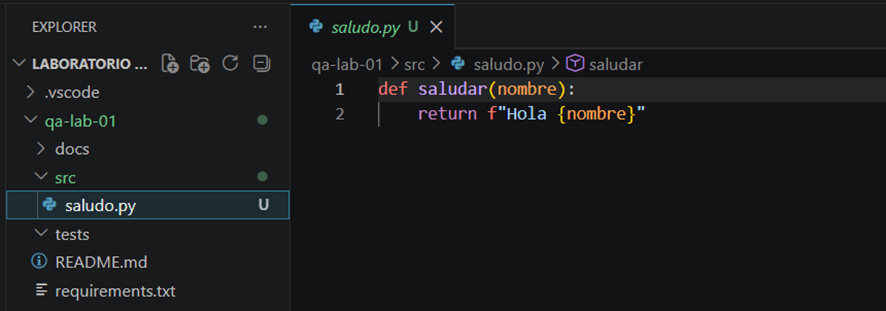 

Archivo test_saludo.py
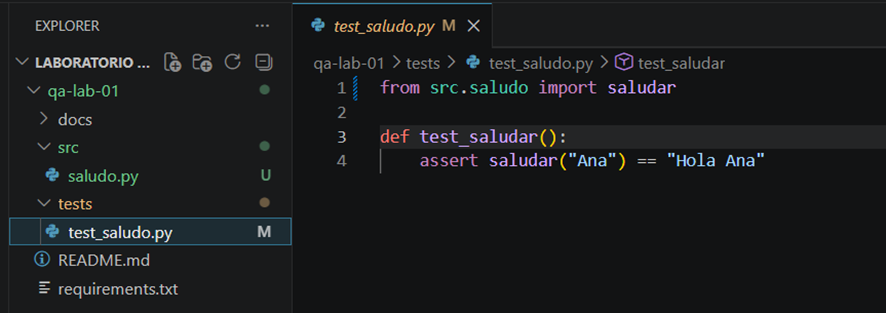 

Ejecutar prueba
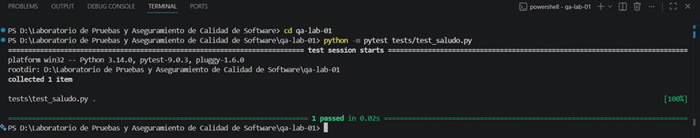 

### Ejercicio 2 — Test de suma

Archivo calculadora.py
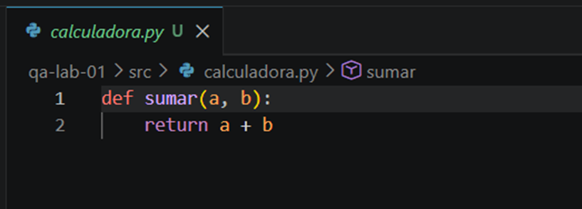 

Archivo test_calculadora.py
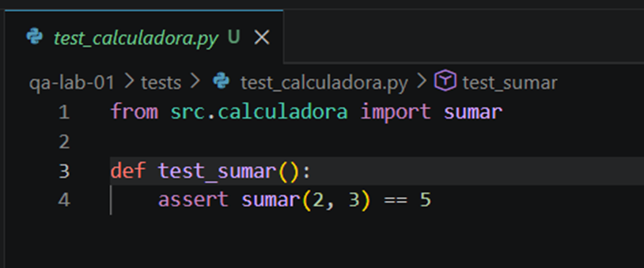 

Ejecutar prueba
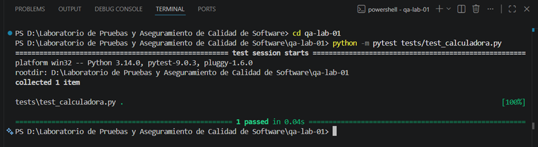 

### Ejercicio 3 — Número par

Archivo numeros.py
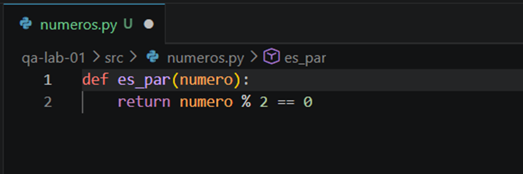

Archivo test_numeros.py
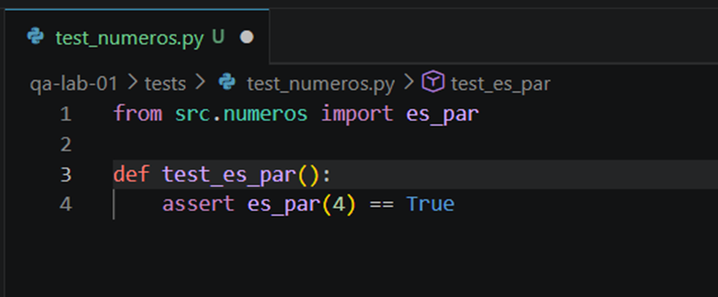

Ejecutar prueba
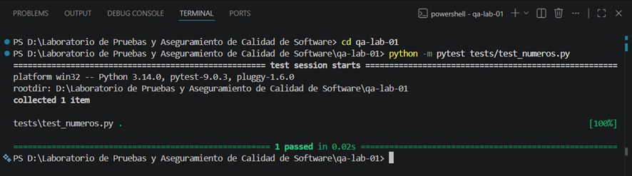 

### Ejercicio 4 — Longitud de texto

Archivo texto.py
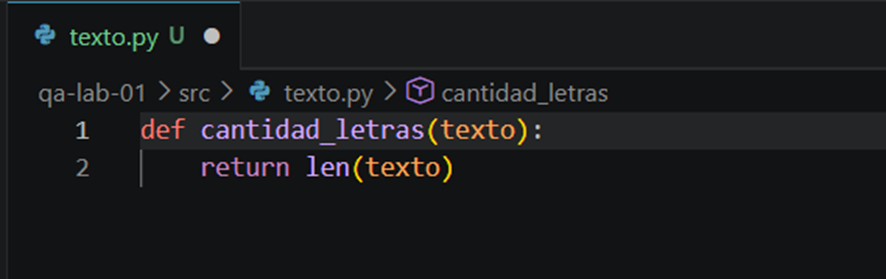

Archivo test_texto.py
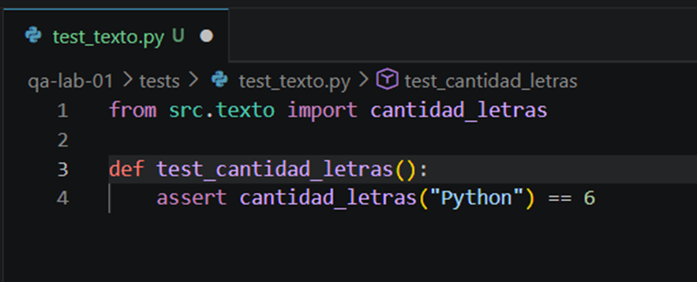

Ejecutar prueba
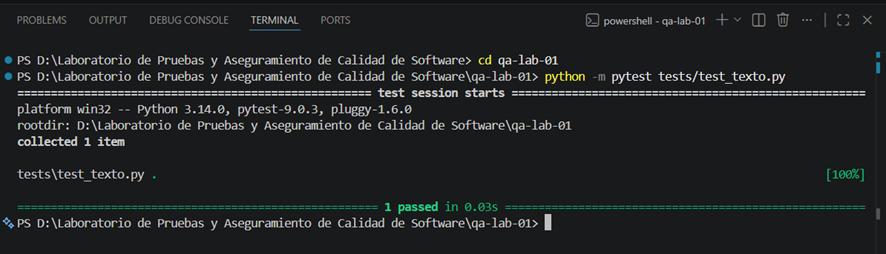 

### Ejercicio 5 — Lista vacía

Archivo listas.py
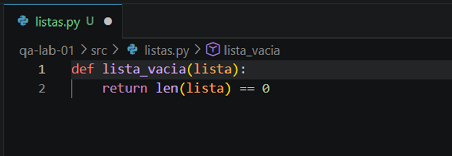

Archivo test_listas.py
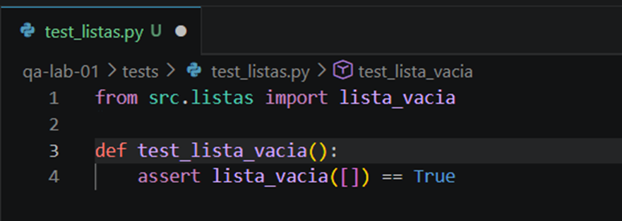

Ejecutar prueba
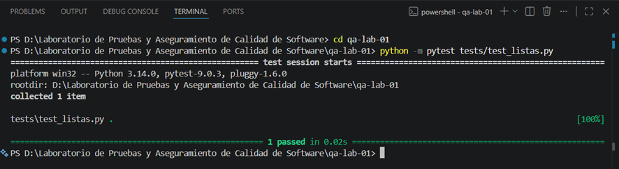 

### Ejercicio 6 — Conversión de temperatura

Archivo temperatura.py
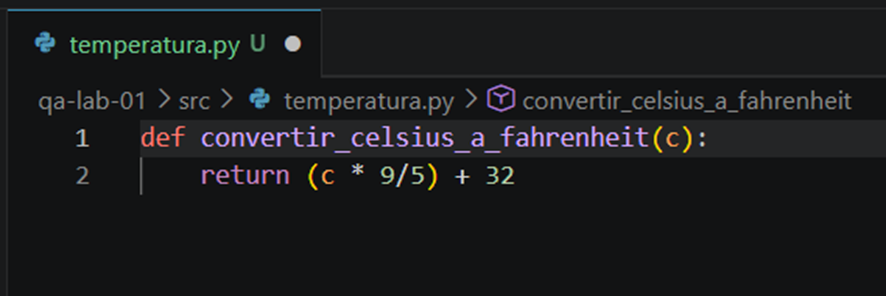

Archivo test_temperatura.py
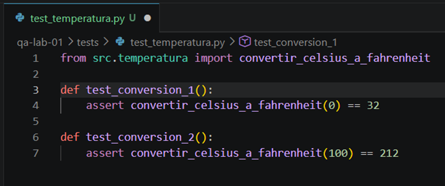

Ejecutar prueba
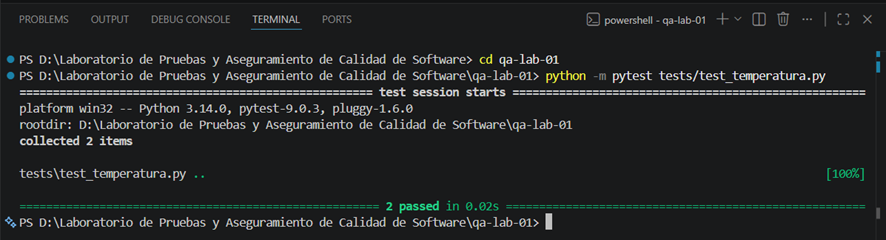 

### Ejercicio 7 — Validación de contraseña

Archivo password.py
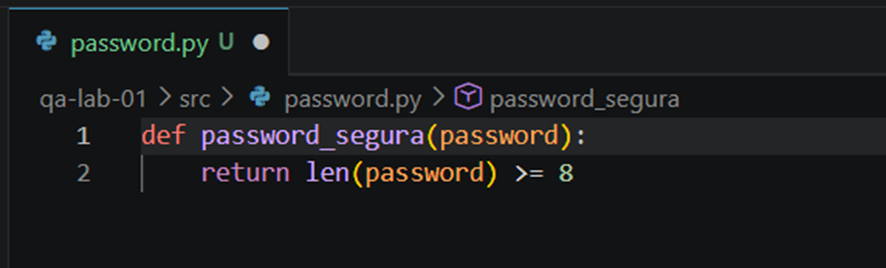

Archivo test_password.py
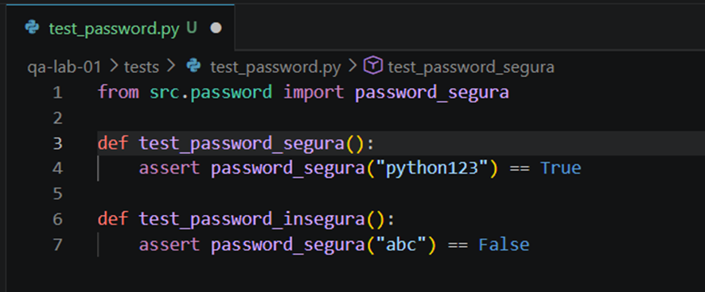

Ejecutar prueba
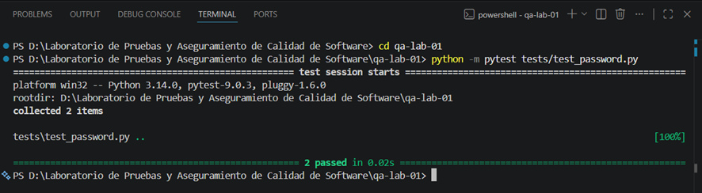 

### Ejercicio 8 — División y excepciones

Archivo division.py
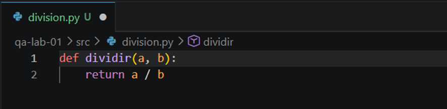

Archivo test_division.py
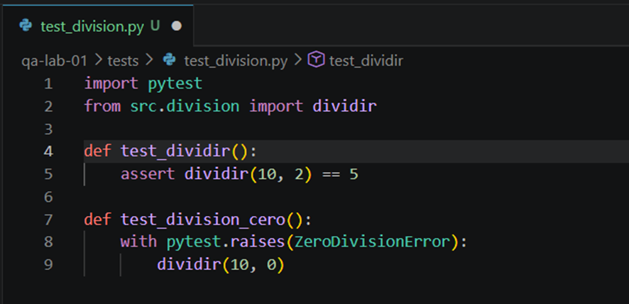

Ejecutar prueba
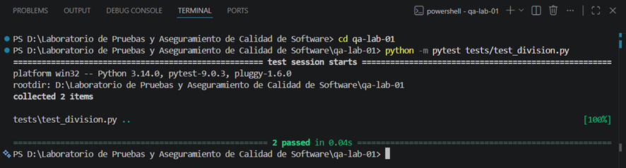 

### Ejercicio Final Integrador

Objetivo

1.	Crear:
•	una función
•	su archivo de prueba
•	ejecutar pytest

Propuesta

Crear una función que determine si un estudiante aprobó.

Regla:

•	nota >= 11 → aprobado
•	nota < 11 → desaprobado

Archivo sugerido
1.	estudiante.py
2.	test_estudiante.py

Archivo estudiante.py
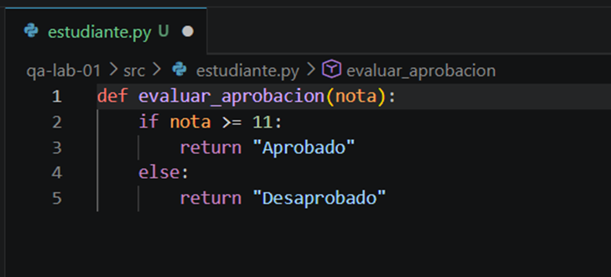

Archivo test_estudiante.py
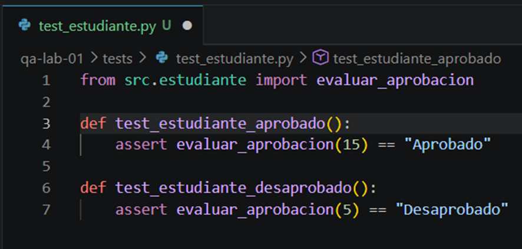

Ejecutar prueba
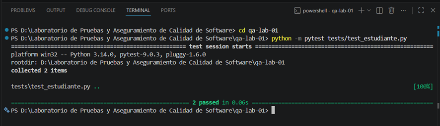 

## Importancia de las pruebas automatizadas

Permiten detectar errores tempranamente y mejorar la calidad del software.

## Autor

Cacñahuaray Meza, Brix Irving